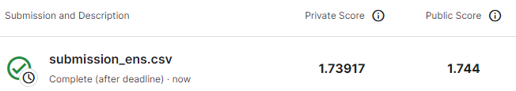
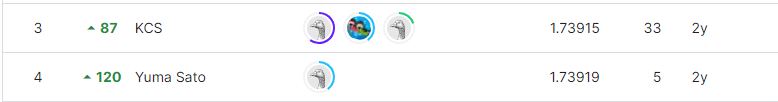

# Tabular Playground Series - Jun 2021
***
# 결과
***
## 요약정보
- 도전기관 : 시큐레이어
- 도전자 : 석민재
- 최종 스코어 : 1.73917
- 제출 일자 : 2023-07-04
- 총 참여 팀수 : 1171
- 순위 및 비율 : 4(0.34%)

# 결과 화면

# 사용한 방법 & 알고리즘
***
- LightAutoML를 통한 최적의 모델 구축
- Keras Tuner를 통해 Simple Neural Network의 최적의 파라미터와 구조 선정
- KNN Feature Extraction을 통해 만들어진 새로운 KNN Features를 사용 데이터에 추가

# 코드

# 참고자료
- https://github.com/momijiame/gokinjo
- https://github.com/keras-team/keras-tuner
- https://github.com/sb-ai-lab/LightAutoML
